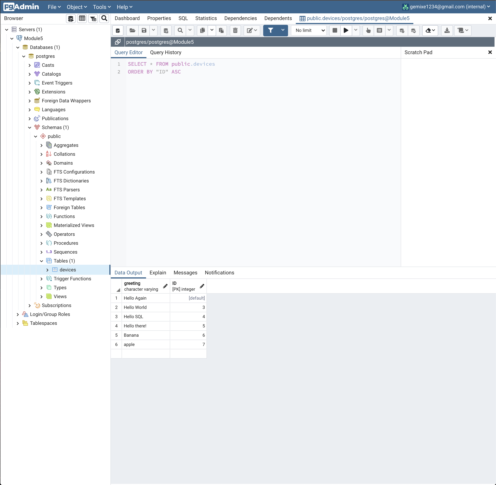
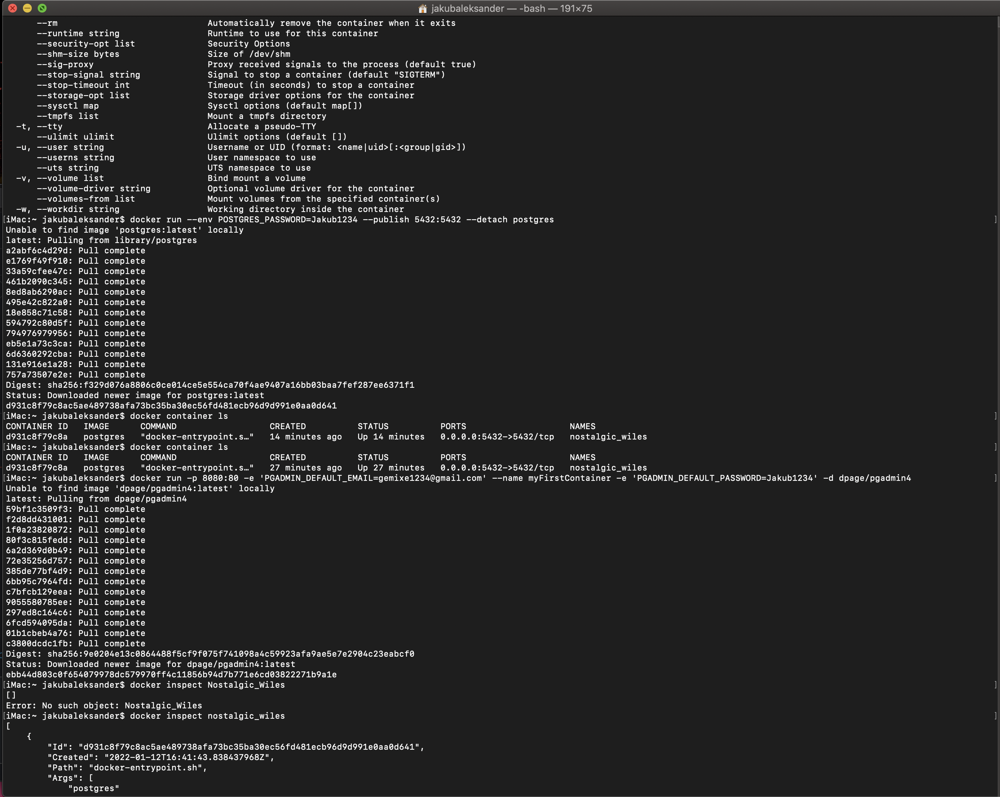

<h2><a href="https://jakubm1999.github.io/pernapp/">LINK TO LIVE SITE</a></h2>
<h2><a href="https://github.com/JakubM1999/pernserver">LINK TO SERVER FILES</a></h2>

Hello, in this project I followed the tutorial similarly NoSQL project. It went very well and for me it was nice to see another way of creating similar things but using other methods.

I feel though that mongoDB method was little bit less complicated to understand and to setup, so I'll most defenetley will use mongoDB. I like the idea of docker and how it works, that it is essentially to create multiple virtual machines on the matter of seconds!

I really enjoyed to learn about all of these things and I will defenetley play around with it more, because this is so wide concept and you can do so many things with it. Other than that I created this function that if you create new object/document it is vissible on the live site aswell as all of the objects/documents that are in one table.

If you have any questions or if you want to see live site just contact me on slack.

I hope that I show everything that was required in skills and knowledge.

